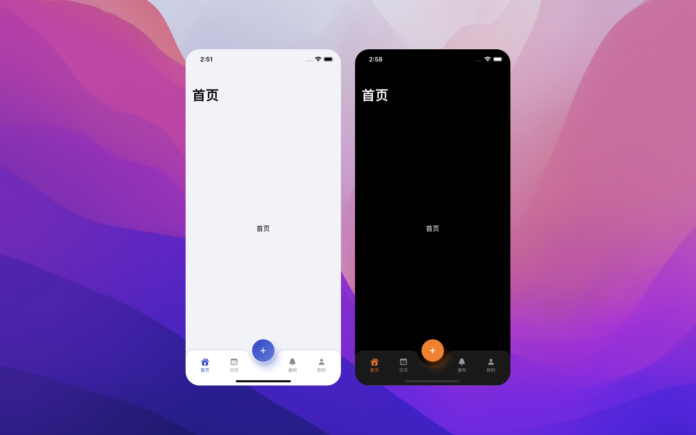
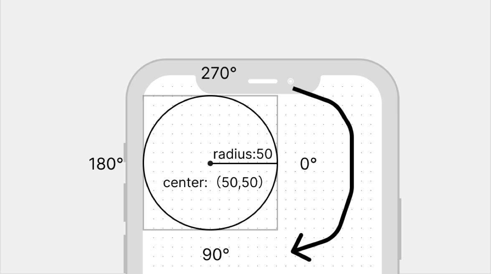
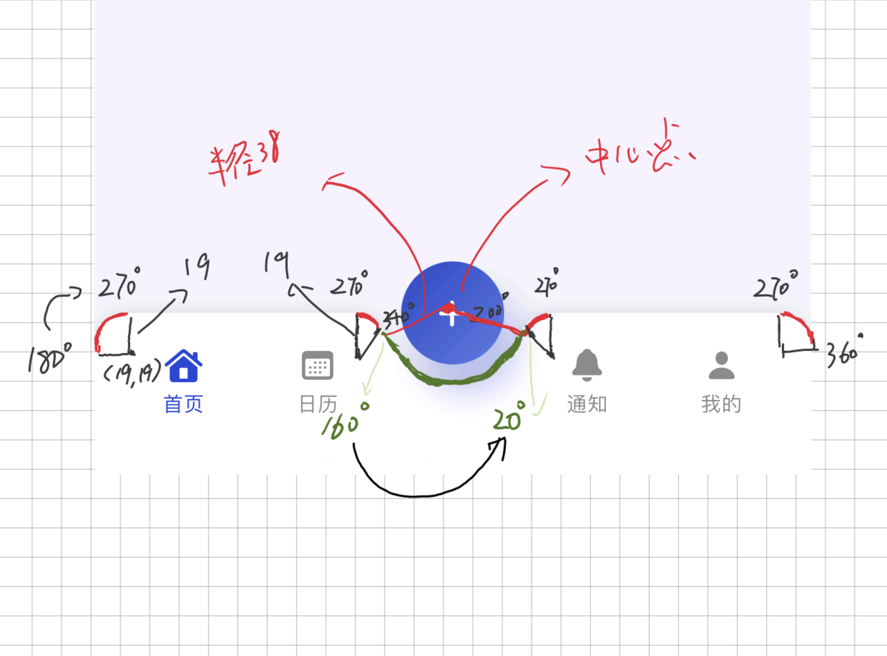

## 效果

## 目标
* 水滴状TabBar背景的实现
* 自定义TabBar布局和事件的实现
## 代码
https://github.com/yuanzj/CustomTabBar

## 正文
### 水滴状TabBar背景的实现
遇到效果图中中间带有水滴凹槽的TabBar背景我们可以让设计提供相应的背景图片，可是使用背景图片在不同的设备下会遇到图片拉伸适配问题。

在SwiftUI中我们可以使用Shape画出这样图形完美解决使用图片产生的问题。

在介绍如何画出上述图形前先介绍需要用的两个方法。
1. 画直线
```swift
mutating func addLine(to p: [CGPoint])
```
比较简单这里不做赘述。

2. 画弧线
```swift
mutating func addArc(center: [CGPoint], radius: [CGFloat], startAngle: [Angle], endAngle: [Angle], clockwise: [Bool], transform: [CGAffineTransform]
```

1. center：画圆弧的中心点
2. radius：画圆弧的半径
3. startAngle：开始角度
4. endAngle：介绍角度
5. clockwise：顺时针方向（缺省为true 时钟逆时针方向,一般设置为fase调整为时钟顺时针）

clockwise为fase时，对应的角度和旋转方向如上图所示


#### Shape水滴凹槽图形实现

```swift
var radius = 38.0

func path(in rect: CGRect) -> Path {

	var path = Path()
	
	let v = radius * 2
	// 移动到0，0点
	path.move(to: CGPoint(x: 0, y: 0))
	// 画左上角90°圆弧
	path.addArc(center: CGPoint(x: radius/2, y: radius/2), radius: radius/2, startAngle: Angle(degrees: 180), endAngle: Angle(degrees: 180+90), clockwise: false)
	// 画中间水滴左边70°圆弧
	path.addArc(center: CGPoint(x: ((rect.size.width / 2) - radius) - radius + v * 0.04 + radius/2, y: radius/2), radius: radius/2, startAngle: Angle(degrees: 270), endAngle: Angle(degrees: 270+70), clockwise: false)
	// 画中间水滴圆弧
	path.addArc(center: CGPoint(x: rect.size.width / 2, y: 0), radius: v/2, startAngle: Angle(degrees: 160), endAngle: Angle(degrees: 20), clockwise: true)
	// 画中间水滴右边70°圆弧
	path.addArc(center: CGPoint(x: (rect.size.width - ((rect.size.width / 2) - radius)) - v * 0.04 + radius/2, y: radius/2), radius: radius/2, startAngle: Angle(degrees: 200), endAngle: Angle(degrees: 200+70), clockwise: false)
	// 画右上角90°圆弧
	path.addArc(center: CGPoint(x: rect.size.width - radius/2, y: radius/2), radius: radius/2, startAngle: Angle(degrees: 270), endAngle: Angle(degrees: 270+90), clockwise: false)
	// 画上边线
	path.addLine(to: CGPoint(x: rect.size.width, y: 0))
	// 画右边线
	path.addLine(to: CGPoint(x: rect.size.width, y: rect.size.height))
	// 画下边线
	path.addLine(to: CGPoint(x: 0, y: rect.size.height))
	// 自动闭合图形
	
	return path

}
```

### 自定义TabBar布局和事件
#### 布局&事件
```swift
var bottomBar: some View {
	
	HStack(spacing: 0) {
	
		Spacer()
		
		ForEach(tabItems) { tabItem in
			Button(action: {
				// 点击Tab菜单切换显示内容
				if tabItem.type == .TabType {
					withAnimation(.easeInOut) {
						selectedTab = tabItem.tab!
					}
				} else {
				// 点击中间新增按钮
					showingAlert = true
				}
			}) {
			
				if tabItem.type == .TabType {
					// Tab菜单按钮
					VStack(spacing: 0) {
						Image(systemName: tabItem.icon)
							.symbolVariant(.fill)
							.font(.body.bold())
							.frame(width: 44, height: 29)
						Text(tabItem.text)
							.font(.caption2)
							.lineLimit(1)
					}
				
				} else {
					// 中间凸起添加按钮
					Image(systemName: "plus")
						.symbolVariant(.fill)
						.font(.body.bold())
						.frame(width: 56, height: 56)
						.foregroundColor(Color.white)
						.background(Circle()
						.fill(LinearGradient(gradient: Gradient(colors: [Color("FloatingButtonTopLeft"), Color("FloatingButtonBottomRight")]), startPoint: .topLeading, endPoint: .bottomTrailing))
						.shadow(color: Color.accentColor.opacity(0.3), radius: 10, x: 8, y: 16))
						.offset(y: -35)
				
				}
			}
			// Tab选中颜色
			.foregroundColor(selectedTab == tabItem.tab ? .accentColor : .secondary)
			.frame(maxWidth: .infinity)
			
			Spacer()
		
		}
	
	}
	.frame(height: 88, alignment: .top)
	.padding(.horizontal, 8)
	.padding(.top, 14)
	
}
```
#### 切换Tab变更中间显示内容
```swift
Group {
	switch selectedTab {
	case .home:
		HomeView()
	case .calendar:
		CalendarView()
	case .notifications:
		NotificationsView()
	case .profile:
		ProfileView()
	}
}

.frame(maxWidth: .infinity, maxHeight: .infinity)
.padding(.bottom, 88.0)
```

Group可以将Modifier应用到其包裹的所有View。
## 尾巴


